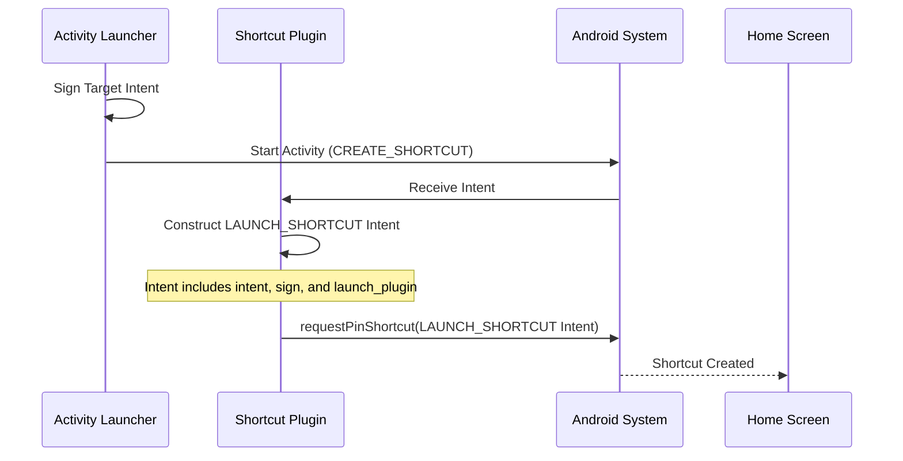
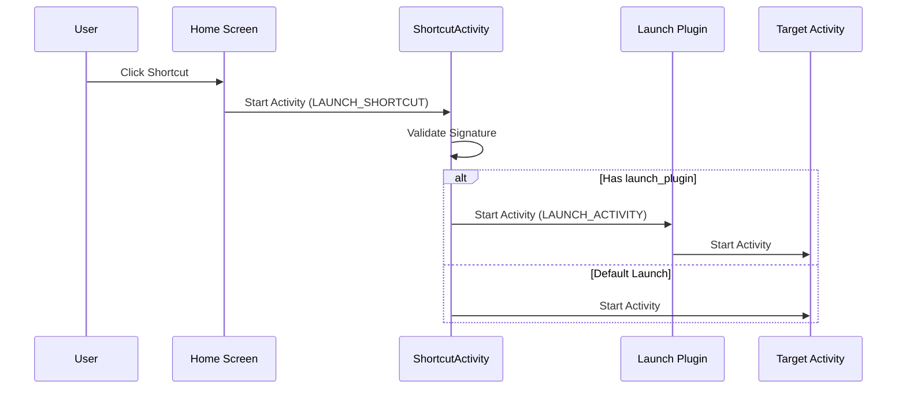

# Plugin Architecture

Activity Launcher supports external plugins for shortcut creation and activity launching. This document describes the intent-based protocol used to communicate with these plugins.

## Shortcut Creation Flow

When a user requests to create a shortcut, Activity Launcher sends a `CREATE_SHORTCUT` intent. A plugin can register for this action to handle the shortcut creation (e.g., to provide custom icons, labels, or to use a different shortcut pinning mechanism).

### Intent: `activitylauncher.intent.action.CREATE_SHORTCUT`

| Extra               | Type   | Description                                                           |
|---------------------|--------|-----------------------------------------------------------------------|
| `name`              | String | The suggested name for the shortcut.                                  |
| `icon`              | Bundle | The icon as a `IconCompat` bundle.                                    |
| `intent`            | String | The target intent encoded as a URI.                                   |
| `sign`              | String | The signature of the target intent URI.                               |
| `shortcut_activity` | String | Flattened `ComponentName` of AL's `ShortcutActivity`.                 |
| `launch_plugin`     | String | (Optional) Flattened `ComponentName` of a plugin to handle the launch. |

### Sequence Diagram

## Shortcut Launch Flow

When a shortcut created by a plugin is clicked, it must launch Activity Launcher's `ShortcutActivity` with the `LAUNCH_SHORTCUT` action.

### Intent: `activitylauncher.intent.action.LAUNCH_SHORTCUT`

| Extra           | Type   | Description                                                           |
|-----------------|--------|-----------------------------------------------------------------------|
| `intent`        | String | The target intent URI (received from `CREATE_SHORTCUT`).              |
| `sign`          | String | The signature (received from `CREATE_SHORTCUT`).                      |
| `launch_plugin` | String | (Optional) Flattened `ComponentName` of a plugin to handle the launch. |

#### Backward Compatibility
For backward compatibility with versions ≤ 2.2.0, Activity Launcher also accepts `extra_intent` as an alternative to `intent`.

### Sequence Diagram

## Launch Delegation

If the `LAUNCH_SHORTCUT` intent contains a `launch_plugin` extra, `ShortcutActivity` will validate the signature and then delegate the launch to the specified component.

### Intent: `activitylauncher.intent.action.LAUNCH_ACTIVITY`

Sent to the component specified in `launch_plugin`.

| Extra    | Type   | Description                                      |
|----------|--------|--------------------------------------------------|
| `intent` | String | The validated target intent encoded as a URI.    |

If no `launch_plugin` is provided, Activity Launcher performs the default launch using `context.startActivity()`.

## Intent Encoding

To ensure robustness and support for complex intents (including extras), Activity Launcher uses `Intent.toUri(Intent.URI_INTENT_SCHEME)` for encoding intents in the `intent` field.

For backward compatibility, `ShortcutActivity` also supports parsing URIs created with the legacy `0` flag.
